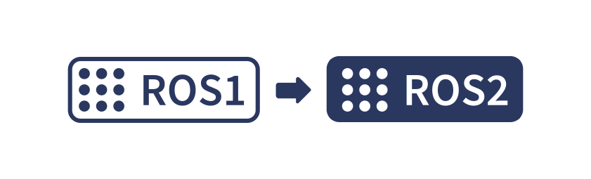
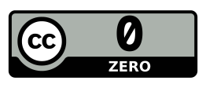

# `ROS1` ➡️ `ROS2` code snippets

Small C++ / Python / launch / Cmake / command examples on the left side the `ROS1` original on the right the `ROS2` equivalents.


## C++ headers

<table><tr><th>ROS1</th><th>ROS2</th></tr><tr><td> 
 
 ``` cpp
#include "ros/ros.h" 
#include "std_msgs/String.h" 
#include "std_msgs/UInt8.h" 
#include "std_msgs/Float64.h" 
#include "nav_msgs/Odometry.h" 
#include "sensor_msgs/NavSatFix.h" 
#include "sensor_msgs/NavSatStatus.h" 
#include "sensor_msgs/Imu.h" 
#include "sensor_msgs/MagneticField.h" 
#include "sensor_msgs/TimeReference.h" 
#include "geometry_msgs/Vector3.h" 
#include "geometry_msgs/PoseStamped.h" 
#include "tf2/LinearMath/Quaternion.h" 
```
 
</td><td>

``` cpp
#include "rclcpp/rclcpp.hpp" 
#include "std_msgs/msg/string.hpp" 
#include "std_msgs/msg/u_int8.hpp" 
#include "std_msgs/msg/float64.hpp" 
#include "nav_msgs/msg/odometry.hpp" 
#include "sensor_msgs/msg/nav_sat_fix.hpp" 
#include "sensor_msgs/msg/nav_sat_status.hpp" 
#include "sensor_msgs/msg/imu.hpp" 
#include "sensor_msgs/msg/magnetic_field.hpp" 
#include "sensor_msgs/msg/time_reference.hpp" 
#include "geometry_msgs/msg/vector3.hpp" 
#include "geometry_msgs/msg/pose_stamped.hpp" 
#include "tf2/LinearMath/Quaternion.h" 

```
</td></tr></table>
 
## C++ init, publish and common commands
 
<table><tr><th>ROS1</th><th>ROS2</th></tr><tr><td> 
 
``` cpp
ros::init(argc, argv, "duro_node"); 
ros::NodeHandle n; 
ROS_INFO("Starting GPS Duro); 
while (ros::ok()) 
{ 
  sbp_process(&s, &socket_read); 
  ros::spinOnce(); 
} 
ros::Time::now(); 
mag_pub.publish(mag_msg); 
```
 
</td><td>

``` cpp
rclcpp::init(argc, argv);
node = rclcpp::Node::make_shared("duro_node");
RCLCPP_INFO(node->get_logger(), "Starting GPS Duro");
while (rclcpp::ok())
{
  sbp_process(&sbp_state, &socket_read);
  rclcpp::spin_some(node);
}
node->now();
mag_pub->publish(mag_msg);


```
</td></tr></table>
 

## Launch
 
<table><tr><th>ROS1</th><th>ROS2</th></tr><tr><td> 
 
``` xml


<!-- orientation_source can be gps / odom  
gps: orientation from the default gps modules 
odom: orientation from previous positions        
-->


<!-- z_coord_ref_switch can be 
zero / zero_based / orig 
zero: the Z coordinate is always 0
zero_based: Z coordinate starts from 
orig: the original Z provided by Duro / Piksi
-->


<!-- euler_based_orientation
true: euler based, not enabled by default
false: quaternion based, not enabled by default
-->
<launch>
    <node pkg="duro_gps_driver" exec="duro_node"
     name="duro_gps_driver" output="screen">


        <param name="ip_address" value="192.168.1.222"/>
        <param name="port" value="55555"/>
        <param name="gps_receiver_frame" value="duro"/>
        <param name="imu_frame" value="duro"/>
        <param name="utm_frame" value="map"/>
        <param name="orientation_source" value="gps"/>
        <param name="z_coord_ref_switch" 
          value="zero_based"/>
        <param name="euler_based_orientation" 
          value="true" />


    </node>
</launch>


```
 
</td><td>

``` py
from launch import LaunchDescription
from launch_ros.actions import Node
"""
orientation_source can be gps / odom  
- gps: orientation provided from the default gps modules 
- odom: orientation counted from previous positions        
z_coord_ref_switch can be zero / exact / zero_based / orig 
- zero: the Z coordinate is always 0
- exact: the Z coorindinate is always z_coord_exact_height
- zero_based: Z coordinate starts from 0 and relative
- orig: the original Z provided by Duro / Piksi
euler_based_orientation:
- true: euler based, not enabled by default
- false: quaternion based, not enabled by default
"""
def generate_launch_description():
    ld = LaunchDescription()
    duro_node = Node(
        package="duro_gps_driver",
        executable="duro_node",
        parameters=[
            {"ip_address": "192.168.1.222"},
            {"port": 55555},
            {"gps_receiver_frame_id": "duro"},
            {"imu_frame_id": "duro"},
            {"utm_frame_id": "map"},
            {"orientation_source": "gps"},
            {"z_coord_ref_switch": "zero"},
            {"z_coord_exact_height": 0.2},
            {"euler_based_orientation": True}           
  
        ]
    )
    ld.add_action(duro_node)
    return ld


```
</td></tr></table>

## Commands
 
<table><tr><th>ROS1</th><th>ROS2</th></tr><tr><td> 
 
``` cpp
catkin build duro_ros

roslaunch duro_ros duro_example.launch
```
 
</td><td>

``` cpp
colcon build --packages-select duro_gps_driver


ros2 launch duro_gps_driver duro_example.launch.py
ros2 launch duro_gps_driver duro_example.launch.xml
```
</td></tr></table>


## C++ rosparam

 
<table><tr><th>ROS1</th><th>ROS2</th></tr><tr><td> 
 
```cpp
n_private.param<std::string> 
        ("ip_address", tcp_ip_addr, "192.168.0.222"); 
n_private.param<int>("port", tcp_ip_port, 55555); 
n_private.param<std::string>("gps_receiver_frame_id", 
        gps_receiver_frame_id, "duro_link"); 
n_private.param<std::string>("imu_frame_id",           
       imu_frame_id, gps_receiver_frame_id); 
n_private.param<std::string>("utm_frame_id",  
         utm_frame_id, "utm"); 
n_private.param<std::string>("z_coord_ref_switch",  
         z_coord_ref_switch, "zero"); 
n_private.param<std::string>("orientation_source",  
         orientation_source, "gps"); 
n_private.param<bool>("euler_based_orientation",  
         euler_based_orientation, true); 

```

</td><td>

``` cpp
node->declare_parameter<std::string> 
           ("ip_address", "192.168.0.222"); 
node->declare_parameter<int>("port", 55555); 
node->declare_parameter<std::string> 
            ("gps_receiver_frame", "duro"); 
node->declare_parameter<std::string>("imu_frame","duro"); 
node->declare_parameter<std::string> 
            ("utm_frame", "map"); 
node->declare_parameter<std::string> 
            ("orientation_source", "gps"); 
node->declare_parameter<std::string> 
            ("z_coord_ref_switch", "orig"); 
node->declare_parameter<bool> 
            ("euler_based_orientation", true); 
node->get_parameter("ip_address", tcp_ip_addr); 
node->get_parameter("port", tcp_ip_port); 
node->get_parameter("gps_receiver_frame",  
                     gps_receiver_frame); 
node->get_parameter("imu_frame", imu_frame); 
node->get_parameter("utm_frame", utm_frame); 
node->get_parameter("orientation_source",  
                     orientation_source); 
node->get_parameter("z_coord_ref_switch",  
                     z_coord_ref_switch); 
node->get_parameter("euler_based_orientation",  
                     euler_based_orientation); 

```
</td></tr></table>
 


## Cmake
 
<table><tr><th>ROS1</th><th>ROS2</th></tr><tr><td> 
 
``` cmake
cmake_minimum_required(VERSION 2.8.3)
project(duro_ros)

## Compile as C++11, supported in ROS Kinetic and newer
add_compile_options(-std=c++11 -O2)
#add_compile_options(-std=c++17 -O2)

find_package(catkin REQUIRED COMPONENTS
  nav_msgs
  roscpp
  std_msgs
  tf2
  tf2_msgs
  tf2_ros
  tf2_geometry_msgs
  #PkgConfig
)

catkin_package(
  INCLUDE_DIRS include
)

include_directories(
 include 
 ${catkin_INCLUDE_DIRS}
"/usr/local/include/"
)


link_directories("/usr/local/lib/")


add_executable(duronode src/duro.cpp src/utm.cpp 
src/fake_orientation.cpp)
target_link_libraries(duronode sbp ${catkin_LIBRARIES})


## Install
install(TARGETS duronode
  RUNTIME DESTINATION ${CATKIN_PACKAGE_BIN_DESTINATION}
)

#set(CMAKE_MODULE_PATH "${CMAKE_SOURCE_DIR}/cmake")


```
 
</td><td>

``` cmake
cmake_minimum_required(VERSION 3.5)
project(duro_gps_driver)

# Default to C++17
set(CMAKE_CXX_STANDARD 17)
# add_compile_options(-std=c++17 -O2)

find_package(ament_cmake REQUIRED)
find_package(rclcpp REQUIRED)
find_package(sensor_msgs REQUIRED)
find_package(std_msgs REQUIRED)
find_package(nav_msgs REQUIRED)
find_package(tf2 REQUIRED)
find_package(tf2_msgs REQUIRED)
find_package(tf2_ros REQUIRED)
find_package(tf2_geometry_msgs REQUIRED)

include_directories(
  include 
  "/usr/local/include"
)

set(ament_dependencies
  rclcpp
  sensor_msgs
  std_msgs
  nav_msgs
  tf2
  tf2_msgs
  tf2_ros
  tf2_geometry_msgs
)
link_directories("/usr/local/lib/")
include_directories("/usr/local/include/")

add_executable(duro_node src/duro_node.cpp src/utm.cpp 
   src/fake_orientation.cpp)
ament_target_dependencies(duro_node ${ament_dependencies})
target_link_libraries(duro_node sbp)

## Install
## Mark executables and/or libraries for installation
install(TARGETS duro_node
  RUNTIME DESTINATION lib/${PROJECT_NAME}
)

## Mark cpp header files for installation
install(DIRECTORY include/${PROJECT_NAME}
  DESTINATION include/${PROJECT_NAME}
)

## Mark launch files for installation
install(DIRECTORY launch 
  DESTINATION share/${PROJECT_NAME}
)

ament_package()


```
</td></tr></table>


## Python

<table><tr><th>ROS1</th><th>ROS2</th></tr><tr><td> 
 
 ``` python
import rospy
#
from std_msgs.msg import String, Float32
rospy.init_node("demo_node", anonymous=True)
#
stringPub = rospy.Publisher("demo_string", String, queue_size=10)
floatPub = rospy.Publisher("demo_float", Float32, queue_size=10)
hello_str = "hello world %s" % rospy.get_time()
stringPub.publish(hello_str)
```
 
</td><td>

``` python
import rclpy
from rclpy.node import Node
from std_msgs.msg import String, Float32
rclpy.init()
node = Node("demo_node")
stringPub = node.create_publisher(String, "demo_string", 10)
floatPub = node.create_publisher(Float32, "demo_float", 10)
hello_str = "hello world %s" % node.get_clock().now()
stringPub.publish(hello_str)
```
</td></tr></table>


<a href="LICENSE"></a>
